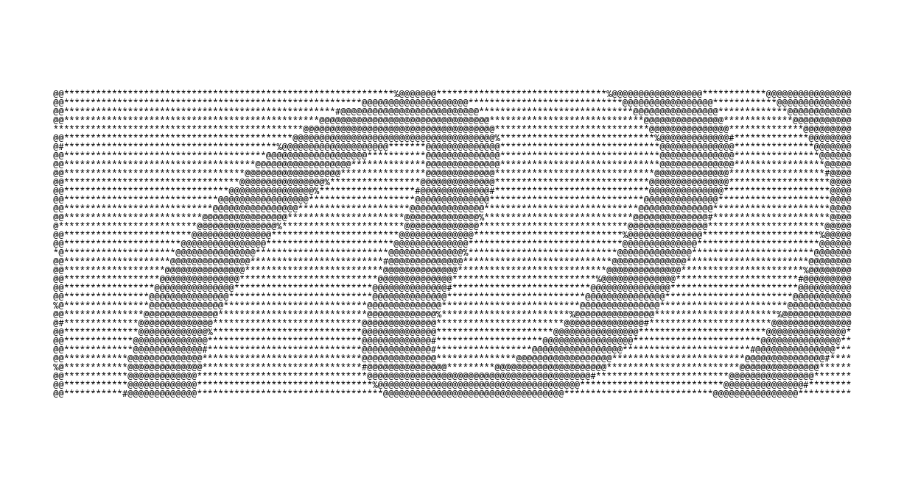

# Welcome to the New UI

You probably noticed that when opening the site, there's a new design and setup, along with a much friendlier color scheme compared to the [old design](https://cloud.fiosproject.de/legacyblog2.png). Instead of green and black, I now use the Catppuccin Mocha color scheme.

The new UI should be usable like the old UI, including the same keyboard shortcuts. However, I changed one keyboard shortcut: help is now triggered with `m`. This is because `h` is already used to go left in the category view. I chose `m` because the tool `fdisk` uses it, and I thought it was a common help shortcut.

# An Excellent Thing: WebTUI

You may have noticed that the design is inspired by a TUI—and yes, it is. This was made possible thanks to the awesome work of [IroncladDev](https://github.com/IroncladDev) and all the [contributors](https://github.com/webtui/webtui/graphs/contributors) of [WebTUI](https://github.com/webtui/webtui). It's a really great product with many well-designed components. It is definitely worth checking out.

# The New Background

The background appears everywhere except the reading page (I couldn't get it working there). Some of you like it, some of you don't. That's why you can turn it off by right-clicking the site, going to the console, and pasting the following command:

```js
localStorage.setItem("bg", false)
```

To enable it again, use:

```js
localStorage.setItem("bg", true)
```

[Here](https://cloud.fiosproject.de/howtoturnofbg.webm) is also a video version showing how to do it. Here's how I created the background:

* I used Inkscape to draw a random shape, then cropped it:


* Then I converted it to ASCII:



* And added some colors:


# The Setup

The setup is just there to make sure Vimium is turned off and to verify that you are human. Some of you may ask: why include a guide for robots on how to scrape? Because I want to count how many actual humans visit my site. My old analytics system also counted robots.

When you're human, it sends a request to `humanlanded.php`. This logs your IP. If you visit again, it uses `isusernew.php` to check if you're already in the log. If so, nothing happens—otherwise, it redirects you to the setup.
